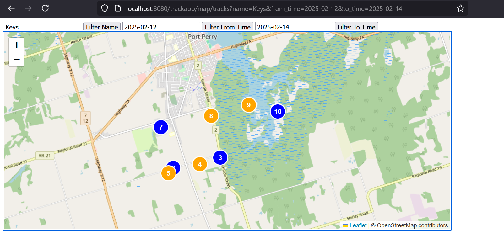

# Tracker App

## Overview

This is a personal project created mainly for learning Django framework. What it does: Collect the latest location data from my Tile&reg; Bluetooth Trackers devices, summarize them, and provide a web app that enables RESTful queries and display the data on a map. The last part is implemented with Django and SQLite.

Here is a demo screenshot showing tile movements in the specified time range (from actual data, but not actual locations).

## Project Structure

Project components are structured into the folders below. Click on the links below for more notes on each component.

- [lambda-layer](./lambda-layer/notes.md): Lambda for polling tile locations
- [etl](./etl/notes.md): ETL scripts to transform the polled location data into location segments
- [app](./app/notes.md): Web app for user data management, query servings and visualization.

## References

### Lambda Python Layer

- [AWS doc - Working with layers for Python Lambda functions](https://docs.aws.amazon.com/lambda/latest/dg/python-layers.html)

### Django

- [Django - Getting Started](https://docs.djangoproject.com/en/5.1/intro/) (official Django docs)
- [Django REST Framework](https://www.django-rest-framework.org/)
- [Django-filter tutorial](https://dev.to/kihuni/comprehensive-guide-to-filtering-in-django-rest-framework-drf-with-a-real-world-example-563p)
- [Leaflet and Django (GeoDjango) Example](https://medium.com/@aminbobekeur/leaflet-django-geodjango-example-b07ff4bc25e8)
